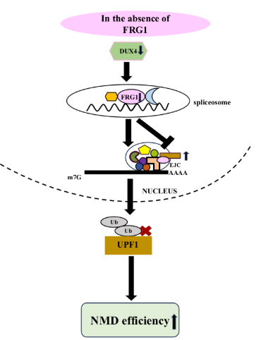

#  FRG1 Regulates Nonsense-Mediated mRNA Decay by Modulating UPF1 Levels

This repository contains the analysis pipeline for RNA-Seq data from FRG1 knockout and knockdown models, aimed at investigating the role of FRG1 in nonsense-mediated decay (NMD) and related pathways.

## Dependencies

To replicate the analysis, ensure the following software and packages are installed:

### Software

-   **FastQC**: Version 0.12.2 (for quality control of sequencing reads)
-   **Salmon**: Version 1.7.0 (for transcript quantification)

### R Packages

-   **IsoformSwitchAnalyzeR**: Version 2.2.0 
-   **ggplot2**: Version 3.5.1 (for data visualization)

### Additional Requirements

-   R (version >= 4.0)
-   A system with sufficient computational resources for RNA-Seq data processing and visualization.

Ensure all dependencies are correctly installed before running the analysis scripts in this repository. The script for the overall workflow is given in the file `runAnalysis.sh`. 

## Authors

-   **Anamika Singh**
    
    -   ORCID: [0009-0006-8423-6898](https://orcid.org/0009-0006-8423-6898)
    -   GitHub: [anamikasingh30](https://github.com/anamikasingh30)
-   **Shithij**
    
    -   ORCID: [0009-0008-3127-9979](https://orcid.org/0009-0008-3127-9979)
    -   GitHub: [sugar-syrup](https://github.com/sugar-syrup/FRG1-NMD)